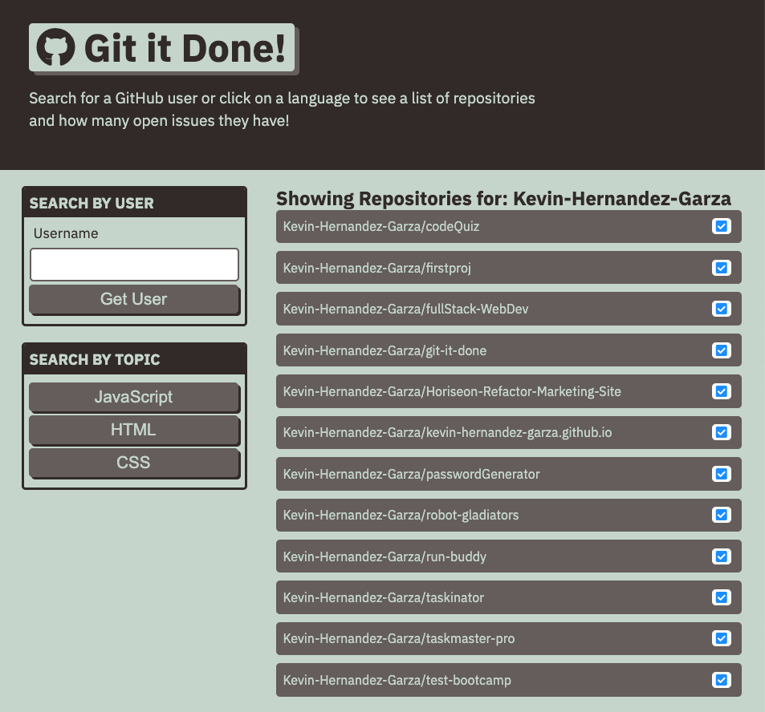

# Git-it-Done

## Description

- Git-It-Done is a web application where we use the GitHub API to search repos and there issues by typing the user account names or by clicking the language topic you would like to view.

## Screenshot

## Website

- https://kevin-hernandez-garza.github.io/git-it-done/

### Contributed by Kevin Hernandez
